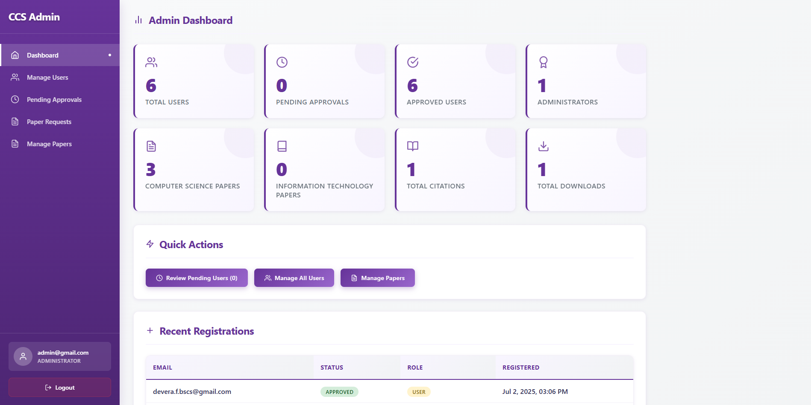
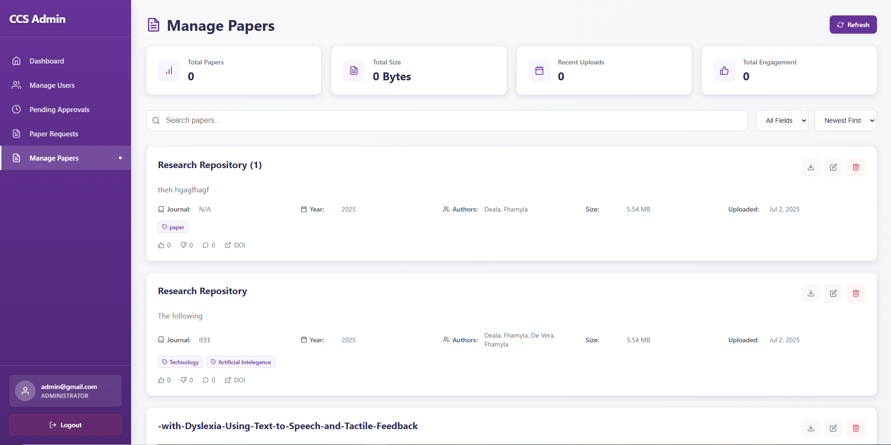
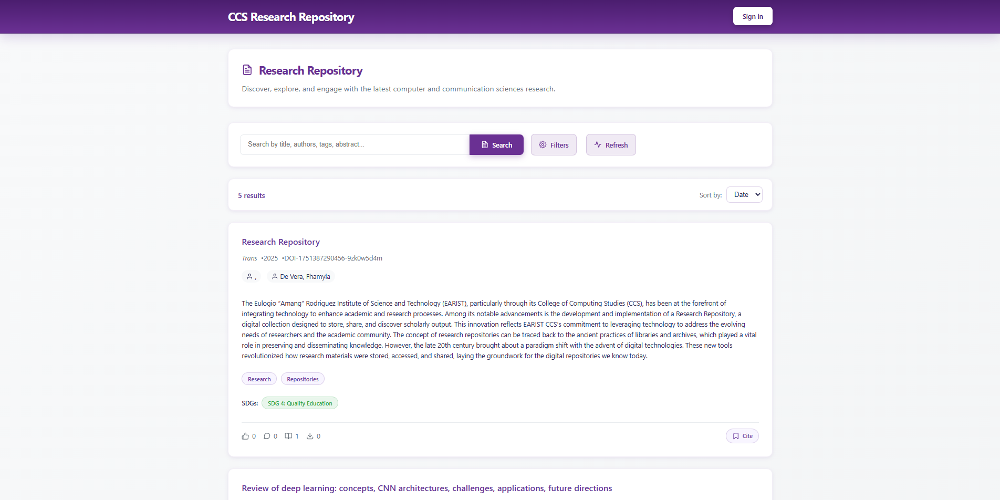
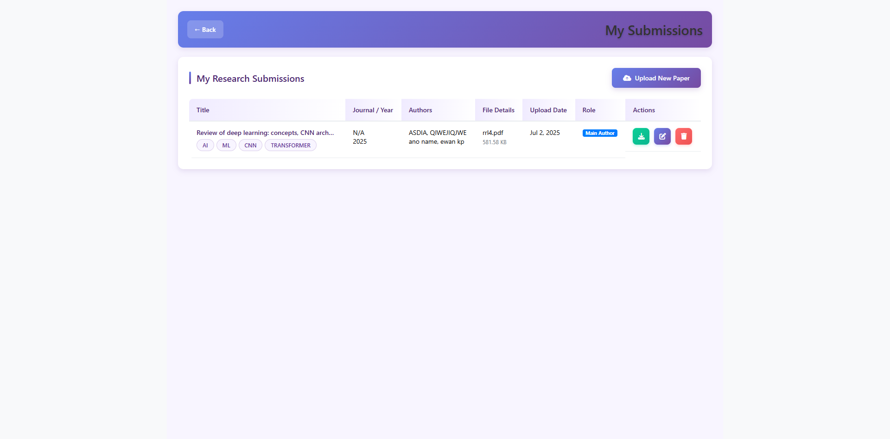

# FAMI Research Paper Repository

A full-stack MERN (MongoDB, Express.js, React, Node.js) web application for managing, sharing, and reviewing academic research papers. This project is designed for academic institutions and research groups to streamline paper submission, review, and access, with a focus on user management, paper metadata, and sustainable development goals (SDGs).

---

## Live Demo

:rocket: **Deployed at:** [ccs-repo.vercel.app](https://ccs-repo.vercel.app)

---

## Features

- **MERN Stack**: Built with MongoDB, Express.js, React, and Node.js for robust, scalable performance.
- **User Authentication & Roles**: Secure registration, login, and role-based access (admin, user, moderator).
- **Paper Management**: Upload, edit, and manage research papers (PDFs stored in MongoDB using GridFS).
- **Rich Metadata**: Track authors, keywords, SDGs, journals, publishers, and more.
- **Admin Dashboard**: Approve users, manage papers, view system stats, and monitor recent activity.
- **Comments & Interactions**: Like/dislike papers, comment, and reply in threaded discussions.
- **Email Notifications**: Automated emails for registration, approval, and paper requests.
- **SDG Tagging**: Papers can be tagged with relevant UN Sustainable Development Goals.
- **Responsive UI**: Modern, mobile-friendly interface using React and Vite.
- **Pics Folder**: All images and assets are stored in `/pics` and used throughout the frontend.

---

## Tech Stack

- **Frontend**: React (Vite), React Router, React Icons, CSS Modules
- **Backend**: Node.js, Express.js
- **Database**: MongoDB (with GridFS for PDF storage)
- **Authentication**: JWT, bcrypt
- **Email**: Nodemailer
- **Other**: Axios, ESLint, modern JavaScript (ES6+)


---

## Screenshots & Images

Below are screenshots of the application. All images are located in the `/pics` folder and are prominently used throughout the UI:

### Admin Dashboard


### Manage Papers


### Homepage


### Upload Paper


---

## MongoDB PDF Storage

- **GridFS** is used to store and manage PDF files in MongoDB. This allows for efficient storage and retrieval of large files, and supports metadata for each paper (authors, title, SDGs, etc).
- Papers are uploaded via the backend API and stored in the `papers.files` and `papers.chunks` collections.
- Download and access permissions are managed via user roles and request workflows.

---

## Getting Started

1. **Clone the repository**
   ```sh
   git clone <your-repo-url>
   cd repo-rework
   ```
2. **Install dependencies**
   - Backend:
     ```sh
     cd backend
     npm install
     ```
   - Frontend:
     ```sh
     cd ../frontend
     npm install
     ```
3. **Configure environment variables**
   - Create a `.env` file in `backend/` with your MongoDB URI and email credentials.
4. **Run the application**
   - Start MongoDB locally or use a cloud instance.
   - Start the backend:
     ```sh
     npm run dev
     ```
   - Start the frontend:
     ```sh
     npm run dev
     ```

---

## License

This project is licensed under the MIT License.
